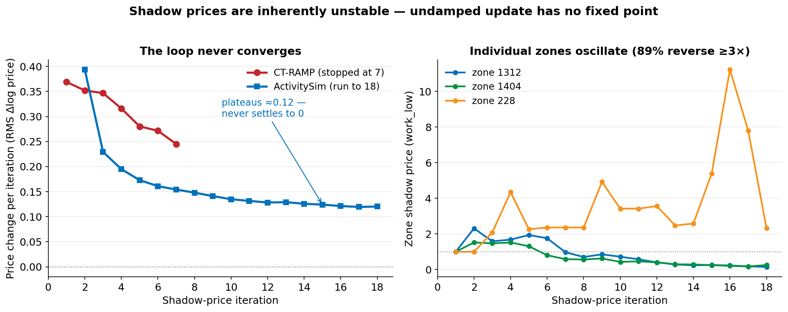

# ActivitySim Migration Notes

Decisions, fixes, and gotchas encountered migrating TM1 from CTRAMP to
ActivitySim 1.5.1. All fixes have been merged into `base-models/activity/configs/`.
Scenario directories (e.g. `scenarios/base_2023_activitysim/activitysim/`) contain only
operational overrides (sample size, shadow pricing, etc.).

## Reference Model Run

The last CTRAMP model run, used as the benchmark for validation:

```
\\MODEL3-C\Model3C-Share\Projects\2023_TM161_IPA_35_testrun
```

---

## Package Structure

| Package | Purpose |
|---|---|
| `src/cubeio` | Pure-Python Cube Voyager I/O (TPP reader, OMX converter) |
| `src/tm1` | TM1-specific utilities (config, Slack, output shimming, CLI) |
| `src/tm1/steps/` | Pipeline steps: setup (copy_inputs, convert_skims), simulate, summarize |
| `scripts/run_model.py` | Convenience entry point — runs full pipeline |
| `scripts/migration_validation/` | Coefficient comparison, ablation, calibration tools |

---

## Input Table Column Mapping

### persons.csv (from PopulationSim `personFile.csv`)

| CSV Column | ActivitySim Column | Notes |
|---|---|---|
| `HHID` | `household_id` | Rename added — was missing in prototype configs |
| `PERID` | `person_id` | Index column |
| `AGE` | `age` | Case fix (CSV is uppercase) |
| `SEX` | `sex` | Case fix (CSV is uppercase) |
| `pemploy` | `pemploy` | No change |
| `pstudent` | `pstudent` | No change |
| `ptype` | `ptype` | No change |

`PNUM` removed from `keep_columns` — ActivitySim derives it internally.

### households.csv (from PopulationSim `hhFile.csv`)

| CSV Column | ActivitySim Column | Notes |
|---|---|---|
| `HHID` | `household_id` | Index column |
| `TAZ` | `home_zone_id` | |
| `HINC` | `income` | |
| `PERSONS` | `hhsize` | |
| `hworkers` | `num_workers` | |
| `VEHICL` | `auto_ownership` | |
| `HHT` | `HHT` | No rename needed |

### land_use.csv (from `tazData.csv`)

| CSV Column | ActivitySim Column | Notes |
|---|---|---|
| `ZONE` | `zone_id` | |
| `COUNTY` | `county_id` | |
| `AREATYPE` | `area_type` | |

---

## Skim Conversion (TPP → OMX)

Skims are converted from Cube TPP to a single `skims.omx` by
`src/tm1/steps/convert_skims.py`. Full mapping in
[SKIM_MAPPING.md](SKIM_MAPPING.md).

Key decisions:
- `wacc`/`wegr` (walk access/egress time) added — prototype configs omitted
  these but `accessibility.csv` references `WLK_TRN_WLK_WACC` / `_WEGR`.
- Aggregate `WLK_TRN_WLK_*` skims come from Cube's "best-path" combined
  transit files. `trn` added to mode list alongside `loc`, `lrf`, `exp`,
  `hvy`, `com`. Same for `DRV_TRN_WLK` and `WLK_TRN_DRV`.
- `WLK_TRN_WLK_IVT` → `WLK_TRN_WLK_TOTIVT`: prototype used `_IVT` for
  aggregate but `_TOTIVT` for mode-specific. Fixed to `TOTIVT` everywhere.
- External zones (1455–1475) included in matrix but unused by ActivitySim
  demand models (assignment-only in TM1 zone system).
- Transit skims use highest available `*.avg.iter{N}.tpp` from reference run.

---

## Output Column Mapping (ActivitySim → CTRAMP)

`tm1.steps.summaries.ctramp_output` shims ActivitySim outputs into
CTRAMP-format CSVs so legacy `CoreSummaries.R` can consume them. Full mapping
in [OUTPUT_MAPPING.md](OUTPUT_MAPPING.md). To be deprecated when R summaries
are replaced.

---

## UEC Crosswalk

| CTRAMP UEC | Sheet(s) | ActivitySim Spec | Notes |
|------------|----------|-----------------|-------|
| `DestinationChoice.xls` | Work | `workplace_location.csv` | |
| `DestinationChoice.xls` | University, HighSchool, GradeSchool | `school_location.csv` | 3 sheets → 1 spec |
| `DestinationChoice.xls` | (non-work) | `non_mandatory_tour_destination.csv` | |
| `AutoOwnership.xls` | — | `auto_ownership.csv` | 11-alt AV-aware model |
| `FreeParkingEligibility.xls` | — | `free_parking.csv` | |
| `CoordinatedDailyActivityPattern.xls` | WorkFromHome | `work_from_home.csv` | New standalone step |
| `CoordinatedDailyActivityPattern.xls` | OnePerson | `cdap_indiv_and_hhsize1.csv` | |
| `IndividualMandatoryTourFrequency.xls` | — | `mandatory_tour_frequency.csv` | |
| `TourDepartureAndDuration.xls` | (per purpose) | `tour_scheduling_*.csv` | |
| `ModeChoice.xls` | Work, Univ, School, … | `tour_mode_choice.csv` | 10 sheets → 1 spec via template |
| `JointTours.xls` | Freq, Comp, Part | `joint_tour_frequency.csv`, etc. | |
| `IndividualNonMandatoryTourFrequency.xls` | — | `non_mandatory_tour_frequency.csv` | |
| `AtWorkSubtourFrequency.xls` | — | `atwork_subtour_frequency.csv` | |
| `StopFrequency.xls` | — | `stop_frequency_*.csv` | Per purpose |
| `StopDestinationChoice.xls` | — | `trip_destination.csv` | |
| `TripModeChoice.xls` | Work, Univ, School, … | `trip_mode_choice.csv` | 10 sheets → 1 spec via template |

### Coefficient Alignment Status

Automated comparison (`scripts/migration_validation/compare_coefficients.py`)
reads CTRAMP UEC sheets and ASim spec CSVs side-by-side using the crosswalk in
`scripts/migration_validation/uec_mappings.py`.

| Submodel | Diffs | Notes |
|----------|------:|-------|
| Workplace Location | 0 | |
| School Location | 0 | |
| Auto Ownership | 0 | |
| CDAP | 0 | Dead-code rows excluded (see below) |
| Work From Home | 0 | |
| Tour Mode Choice | 0 | |
| Trip Mode Choice | 1 | Accepted structural diff (see below) |
| **Total** | **1** | |

**Trip MC accepted diff:** ASim has `sov_available == False → -999` for `atwork`
purpose as a safety net. CTRAMP handles DA unavailability for sub-tours
elsewhere. Harmless and intentional.

**CDAP dead-code rows (79–84):** Not ported.
- Rows 79–82: tokens `noUsualWorkLocation`/`noUsualSchoolLocation` always
  return 0 in MTC implementation — never fire.
- Rows 83–84: M unavailable for retired/non-working — functionally present in
  ASim via `coef_UNAVAILABLE` (−999) on M column for ptypes 4 and 5.

---

## Ported Submodels

### Work From Home

CTRAMP has a WFH sub-model embedded in CDAP (`WorkFromHome` sheet). It runs a
binary logit per worker using income, industry, home/work county, distance, and
34 superdistrict calibration constants. Workers chosen WFH get Mandatory
blocked (−999); remaining FT/PT workers get compensating M boosts (+0.5638,
+0.6822).

ActivitySim port:
- `work_from_home.yaml` / `.csv` / `_coefficients.csv` implement the same
  binary logit with all 12 estimated coefficients plus calibration constant.
- `work_from_home_annotate_persons_preprocessor.csv` computes industry dummies
  (stochastic draw from employment mix at work TAZ), county/superdistrict
  lookups, and eastbay↔SF dummy.
- Pipeline: `work_from_home` inserted between `free_parking` and
  `cdap_simulate`.
- `cdap_indiv_and_hhsize1.csv` has 3 new rows: M unavailable for WFH workers,
  FT M boost, PT M boost.
- EN7 superdistrict boosts (34 constants, all 0.0) present as placeholders.

### Auto Ownership (11-alt AV-aware)

TM1's AO model uses 11 alternatives distinguishing human/AV ownership
patterns. `auto_ownership_annotate_households.csv` remaps the 11-alt choice
back to 0–4 vehicle count for downstream models.

---

## Shadow Pricing & Location-Choice Parity

Location choice is balanced by an iterative *shadow-price* loop (a per-zone size-term
multiplier nudged toward a target count). CT-RAMP and ActivitySim share the same `ctramp`
update.

**Parity is proven with a frozen jig.** Freeze skims (corr 1.00000) and load CT-RAMP's own
`ShadowPricing_7` (`LOAD_SAVED_SHADOW_PRICES: True`, 1 pass, no re-solve): ActivitySim then
reproduces CT-RAMP — **work +0.6%, university +2.0%, school +0.1%** mean distance, every
county within a few percent (Solano univ fill 0.89 vs CT 0.92). *Same prices in ⇒ same
placement out* — the model is at parity, independent of whether the price algorithm converges.

**The algorithm does not converge — for either model.** The undamped update
`price *= scaledSize/modeled` (`DAMPING_FACTOR: 1`) is not a contraction and has no fixed
point. Per-iteration price change plateaus above zero and individual zones oscillate
indefinitely (89% reverse direction ≥3× over 18 iterations):



Consequences:
CT-RAMP's reference prices are a **stopping artifact** (it halts at ~7 iterations regardless
of fit: `ShadowPricing_5` + 2), not an equilibrium; and running ActivitySim *longer* drifts
*away* from them (price r vs CT-RAMP peaks 0.987 @ iter 8, falls to 0.958 @ 18; work error
grows +2.6%→+4.5% from 12→18 iters). `check_fit` never converges because `max_fail` is a
constant threshold, not a fit measure. **We do not try to fix this in CT-RAMP** — forcing
convergence would need damping (`DAMPING_FACTOR < 1`), which does converge but to a
*different* equilibrium than the undamped reference, so ActivitySim would no longer match the
reference `wsLocResults`. Production seeds the reference prices and runs a few iterations —
CT-RAMP's own practice.

**Accommodations applied for parity** (ActivitySim/tm1 settings, not CT-RAMP changes):

| # | Item | Why | How |
|---|---|---|---|
| 1 | `SCALE_SIZE_TABLE: True` | ActivitySim default `False`; ctramp compares modeled *counts* to a size target that must be scaled to chooser population. Unscaled → mis-normalized targets (univ 0.60×, work_veryhigh 2.25×) → campus sinks (Solano fill 1.51). | set True (full-pop runs); Solano → 0.80 |
| 2 | Grade school unpriced | CT-RAMP excludes grade school (assignment, not choice) — *accidentally*: flag key misspelled `GradeSChool` (`UsualWorkSchoolLocationChoiceModel.java:41`) always throws → excluded unconditionally. ActivitySim prices all school segments; pricing it inflates school error (+3.3%, SF +20.8%). | hold grade-school price = 1.0 → +1.5%, SF −0.2%, via version-guarded `tm1` override (asim pinned to a wheel) |
| 3 | Preschoolers | 307k preschoolers (ptype 8) inflate our grade-school target (1.26M vs CT ~954k); CT-RAMP classes them `Not student`. Only matters *because* we price grade school. | subsumed by #2 |
| 4 | Price granularity | CT-RAMP prices per `(zone, subzone)`; ActivitySim per TAZ. Aggregate parity holds. | intrinsic, accepted |

**Validation jig vs production** (kept as separate scenario setups):

| | Validation jig | Production |
|---|---|---|
| Skims | frozen (reference final) | live (assignment loop) |
| Shadow prices | frozen (`ShadowPricing_7`, 1 pass) | seed reference + few iters |
| Grade-school pricing | as-reference (excluded) | excluded (override) |
| Purpose | isolate model for CT-RAMP comparison | forecast |

---

## Divergence & Fix Ledger

Every divergence from CT-RAMP found during migration, with its resolution. Rows 1–11 are
corrected bugs (ActivitySim now matches CT-RAMP); details in git history
(`git log --grep "mode choice"`). Shadow-pricing accommodations are in the section above.

| # | Area | Divergence from CT-RAMP | Resolution |
|---|---|---|---|
| 1 | CDAP | 5+‑person HHs assigned M pattern with no valid mandatory dest → invalid tours (~600, 0.04%) | reset `cdap_activity` M→N when no work/school zone (`annotate_persons_cdap.csv`) |
| 2 | Tour MC | same M-leak → dest −1 → NaN density → `pd.cut` crash | defensive `fillna(0)` in density preprocessor |
| 3 | CDAP report | person-type labels mismatched; ptypes 6/7 swapped in enum | aligned `PTYPE_LABELS` / `CTRAMPPersonType` |
| 4 | Plumbing | `work_location` column absent in stage 1 | `io.py` maps both `workplace_zone_id` / `assigned_workplace_zone_id` |
| 5 | Trip MC | at-work coeffs divided by tour `c_ivt` (−0.0134) not trip `c_ivt` (−0.0279) — upstream prototype_mtc error | corrected 10 coeffs (e.g. `walktimeshort_atwork` 1.35→2.00) |
| 6 | Trip MC | `heavy_rail`/`express_bus` per-purpose ASCs pulled from `light_rail` row | corrected ASCs |
| 7 | Trip MC | "didn't drive to work" rows −999 vs CT-RAMP 0.0 (dead code) | set 0.0 |
| 8 | Trip MC | missing hesitance constant rows | added 10 rows + IVT multipliers (LRT/ferry) |
| 9 | Tour MC | transit hesitance constants absent in prototype_mtc | added work 55.0 / rail 108.0 / nonwork 0.0 |
| 10 | Trip MC | trip-level CONSTANTS inherited tour-MC values | set trip values (`xfers_wlk` 15, `origin_density` −0.6, …) |
| 11 | Plumbing | joint tours share `tour_id` → duplicate-index crash (pandas 2.x; also an upstream bug) | dedup before `.map()` in `write_trip_matrices` |

---

## Slack Notifications

Migrated from `model-files/scripts/notify_slack.py` → `src/tm1/slack.py`.
- Webhook from `SLACK_WEBHOOK_URL` env var or MTC default file.
- Notifications at setup, ActivitySim start, pipeline milestones, finish/error.
- Disable with `--no-slack`.
