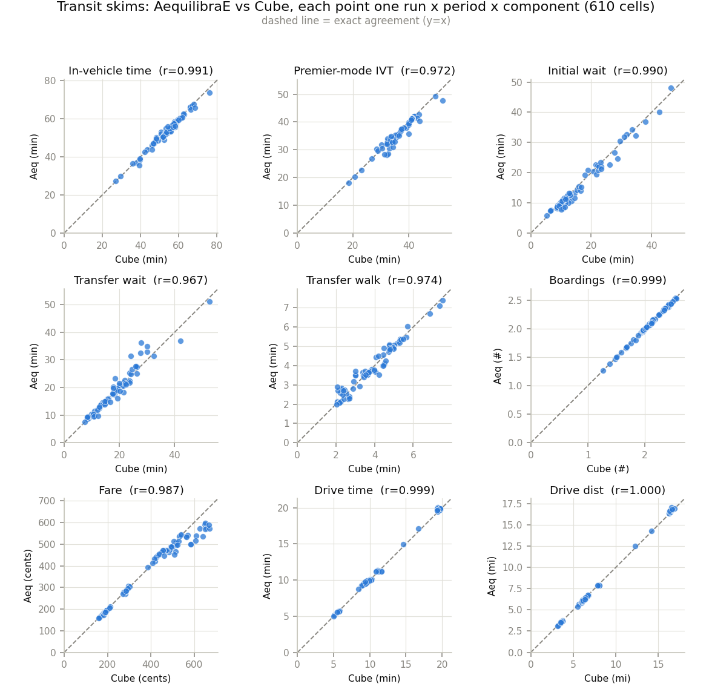
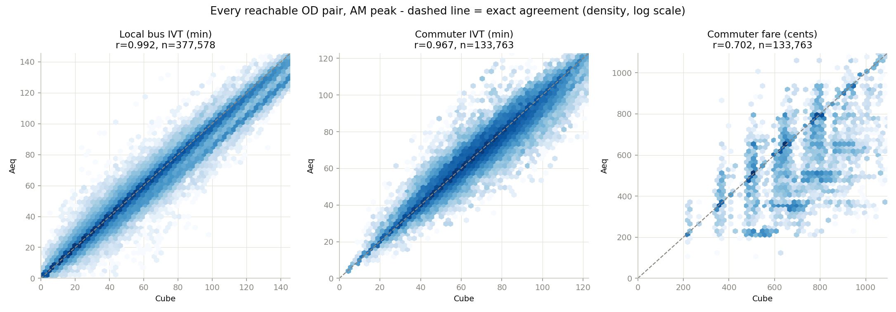
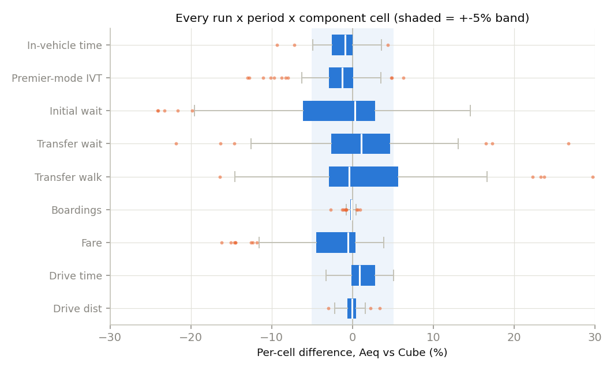
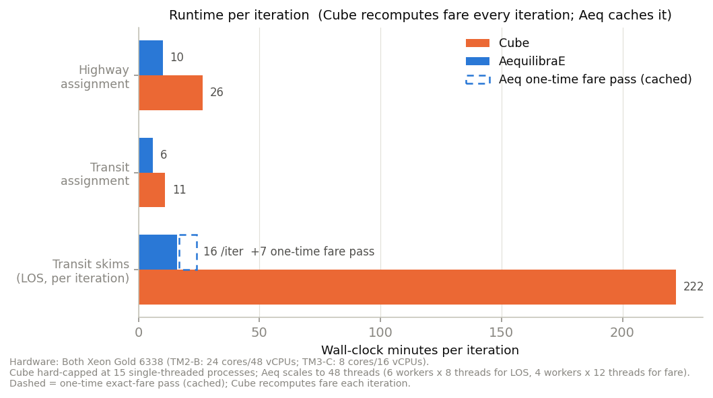

# Replacing Cube with AequilibraE in Travel Model One

Travel Model One runs highway assignment, transit assignment, and skimming on Bentley Cube
Voyager (licensed, closed, ~3.7 hr/iteration for transit skims). This work replaces that
Cube portion with an open-source Python implementation on AequilibraE, feeding the same
demand model with no re-calibration. This brief is the evidence that it reproduces Cube's
results and matches or beats its runtime.

Same algorithms in both; the new pipeline differs only in implementation and in a few
documented accommodations (Section 5) where the open-source library cannot reproduce a Cube
behaviour exactly. All figures are against a 2023 reference Cube run (`2023_TM161_IPA_35`).

| Step | Algorithm (both) | Fit vs Cube | Cube | Aeq |
|---|---|---|---|---|
| Highway assignment | Frank-Wolfe user equilibrium | VMT +0.1 to +0.2%, skim r 0.98-1.00 | 25-28 min/iter | ~10 min/iter |
| Transit assignment | Spiess-Florian optimal strategy | boardings +0.1%, per-line r 0.98 | ~11 min/iter | ~6 min/iter |
| Transit skims | cost accumulated along the strategy | median component within ~1%, r 0.91-0.99 | ~3.7 hr/iter | ~16 min/iter (concurrent) + one-time ~7 min fare pass |

**Environment.** Aeq measured on TM2-B; Cube from reference-run logs on MODEL3-C. The two
are VMs with identical CPUs (Xeon Gold 6338, 2.0 GHz; TM2-B 48 vCPU / 512 GB, MODEL3-C
16 vCPU / 196 GB), and Cube's transit step runs as 15 single-threaded cluster processes —
fully provisioned on both — so the timings compare like-for-like silicon (Section 3).

---

## 2. Match

The 75-run transit-skim battery (15 access × line-haul × egress combinations × 5 periods)
scores each component against Cube on the OD pairs both reach. Every component tracks the
line of exact agreement:

At the individual-OD-pair level behind those correlations, agreement is tight for the
workhorse skims. The one visible spread is the commuter fare (the single hardest cell —
the median fare cell is -0.6%, r 0.924):

The banding is a reporting-convention difference. **Cube reports the single best path**
(verified: its boardings are exact integers, four distinct values); **aeq reports the
strategy-expected value**, the probability-weighted average over the attractive path set
(its boardings take a continuum of values). Fare is a step function of boarding/alighting
station, so where a strategy spreads over paths boarding at different stations, aeq's
expected fare averages those legal fares and falls between Cube's discrete values. Bounded,
not a computation error: 64% of pairs match Cube to the cent, every aeq fare lies within
the legal fare range, and 100% of off-grid values fall between two adjacent legal station
fares.

Across all 610 run-component cells the differences cluster inside ±5%; the tails are the
named families of Section 6 (transfer wait/walk, off-peak commuter fare), each with a
verified mechanism:

Median cell per component (mean over jointly-reachable OD pairs; see Section 4):

| Component | Cube | Aeq | Δ abs | Δ % | r |
|---|---|---|---|---|---|
| In-vehicle time, total | 55.4 min | 54.8 min | -0.5 | -0.9% | 0.985 |
| In-vehicle time, premier mode | 37.8 min | 37.3 min | -0.5 | -1.2% | 0.972 |
| Initial wait | 12.7 min | 12.5 min | -0.2 | +0.3% | 0.908 |
| Transfer wait | 15.2 min | 15.4 min | +0.2 | +1.1% | 0.914 |
| Transfer walk | 3.8 min | 3.7 min | -0.1 | -0.4% | 0.840 |
| Boardings | 2.09 | 2.08 | -0.01 | -0.1% | 0.988 |
| Fare | 420c | 409c | -12c | -0.6% | 0.924 |
| Drive access/egress time | 10.8 min | 10.9 min | +0.1 | +0.9% | 0.994 |
| Drive access/egress distance | 7.8 mi | 7.8 mi | -0.0 | -0.0% | 0.994 |

Every median component is within ~1% at correlation 0.91-0.99 (transfer walk 0.84 on
2-4 minute legs). 90 of 610 cells lie beyond 5% with correlation under 0.90; all belong to
the Section 6 families.

## 3. Performance

Transit skimming is where the gap is largest, and it turns on *what changes each iteration*.
Cube recomputes every transit skim — level-of-service and fare — on all 15 cluster processes
every iteration (3.7 hr). The new pipeline recomputes only the congestion-dependent
level-of-service skims each iteration and runs the static exact-fare pass once. A model run
is 4 skim passes (iterations 0-3):

| Transit skims, full run | Cube (per iter) | Aeq |
|---|---|---|
| Per-iteration level-of-service skims | 3.7 hr | **~16 min** |
| One-time exact-fare pass | — (redone every iter) | ~7 min |
| **Full 4-iteration run** | **14.8 hr** | **~1.2 hr** |

**Per iteration the new pipeline is ~14× faster** (16 min vs 3.7 hr), because the static
fare is computed once rather than every iteration; over a full 4-iteration run it is ~12×.
The fare pass is also cached across runs of the same network, dropping repeat runs to the
~16 min/iteration cost.

Both passes run as concurrent worker pools on TM2-B: the 75 level-of-service skims in
~16 min, the 15 exact-fare skims in ~7 min. The fare graphs are fast to skim because
their history states (previous operator, boarding station — needed for exact transfer and
station-to-station fares) are materialized *sparsely*: only states actually reachable in
the network are built, ~1M edges per graph versus ~21M if every stop carried every
operator state. Sparsity is also the memory story: the entire max-speed fare pass peaks
at **12.4 GB of RAM**, where a single dense-graph skim needed ~26 GB (~79 GB with three
concurrent) — sparse graph representation, plus caching what is static, is the core of
aeq's speed and memory advantage over Cube here.

**Cross-machine note.** Aeq is measured on TM2-B; Cube timings come from reference-run
logs on MODEL3-C. Both are VMs on identical Xeon Gold 6338 cores, and Cube's 15
single-threaded cluster processes are fully provisioned on both machines, so its
per-core-bound timings transfer directly; residual bias is VM host-load noise.

## 4. How the comparison is defined

A **cell** is one component of one run (access × line-haul × egress × period). Over the OD
pairs both models reach:

    Δ% = (mean Aeq − mean Cube) / mean Cube        r = Pearson correlation across pairs

Tables report the **median cell** per component across the 75 runs (taken per component, so
rows may land on different runs). *Example:* transfer wait, median run — Cube 15.2 min, Aeq
15.4 min → +1.1%, r 0.914. Two reading notes: Δ is a difference of means, so per-pair errors
can offset (hence the correlation column); pairs are equal-weighted, so these figures are
skim fidelity, not demand-weighted mode-choice impact.

## 5. Method and accommodations

Ground truth is one reference Cube run. `scripts/build_aeq_inputs.py` converts the Cube-era
inputs into a self-contained set (converted once, no Cube at run time); bus in-vehicle times
use each iteration's congested road times, as Cube does. No constant is tuned to force
agreement. Where the open-source algorithm cannot reproduce a Cube behaviour exactly, a
documented accommodation applies:

| Accommodation | Cube | Aeq | Faithful? |
|---|---|---|---|
| Network averaging | skims a method-of-successive-averages network | same MSA network | reproduces |
| Combined-headway window | COMBINE merges lines within ~5 min of fastest | frequency inflation `w≈1.5` reproduces Cube's wait | parity choice, one parameter |
| Premier-mode reachability | one skim set per line-haul; keep pair if best path uses it | keep pair where premier-mode IVT > 0 (held for every reference pair) | reproduces |
| Transfer fare | history-dependent (previous operator) | post-alighting stop states labelled by operator ridden (only reachable (stop, operator) states materialized) | reproduces (exact) |
| Rail station fare | exact station-to-station `.far` matrix | exact FAREMAT lookup (symmetrized); distance curve only as fallback for pairs the fare pass cannot reach | reproduces, bounded fallback |

**Kernel speed fix.** AequilibraE's transit kernel spent almost all its time sorting edges
by near-identical placeholder keys, degrading toward quadratic on this compiler. Sorting
only the strategy's edges cut per-destination cost ~200×. It reproduces the library's
results exactly and is merged upstream; this pipeline pins the merged commit.[^pr]

**Two-graph fare.** The operator-labelled fare graph is exact and static, so it runs once
and is cached; every other skim uses a fast graph refreshed each iteration. Cube recomputes
everything, fare included, each iteration.

[^pr]: AequilibraE pull request 806, https://github.com/AequilibraE/aequilibrae/pull/806

## 6. Divergence ledger

Every known difference from Cube with its verified mechanism. Standard of proof: a
divergence is "explained" only once a falsifiable test isolates its cause. The median cell
is at parity; this ledger accounts for the 90 tail cells.

| # | Family | Size (worst cell) | Absolute | Mechanism | Status |
|---|---|---|---|---|---|
| 1 | Commuter-rail path composition | fare -9% (AM), KEYIVT -2 to -3% | ~-60c | S&F rides cost-optimal Caltrain pattern; Cube COMBINE rides the frequency-blended pattern | both valid (see below) |
| 2 | Reported waits under-pool | IWAIT -1 to -2 min (dense stops) | ~-1.5 min | S&F pools all attractive lines; Cube's window pools fewer | accommodation (§5, `w`) |
| 3 | Spread-slice vs COMBINE window | express off-peak XWAIT +29% | ~+8 min | S&F charges the boarded line's wait; Cube charges a blend over near-equal services | convention difference, bounded |
| 4 | Transfer-walk link timing | WAUX +30-40% (express) | ~+24 sec | transfer connectors timed slightly longer; **not routing** (boardings identical, r(excess)≈0) | input-timing convention, bounded |
| 5 | Reachability edges | com recall 94-97% | | near path-time limits S&F and single-path cost fall opposite sides; Aeq also reaches pairs Cube misses | intrinsic, bounded |

**Family 1 (the structural divergence), evidence chain.** Both engines are Spiess-Florian;
they differ only in how simultaneous services merge. Where Caltrain runs local/limited/
bullet patterns, Cube reports the blended run time and fare; Aeq rides the cost-optimal mix.
(1) A 2-min rail boarding bonus flips only 1% of divergent pairs — not ties. (2) Line-level
tracing: divergent pairs ride bullet/limited patterns where matched pairs ride locals.
(3) On 99 single-boarding pure-rail pairs the Aeq path is 61.4 min vs Cube 66.1 for the same
seat. (4) Priced under Cube's own generalized-cost rules, the Aeq path is strictly cheaper
on 64% of divergent pairs. Where they disagree, Aeq's path is better under Cube's own
weights. Not correctable without choosing worse paths.

The fare specifically also carries a **reporting-convention** difference (Section 2): Cube
reports the best path's fare (a discrete station-pair value), aeq the strategy-expected
fare (a bounded average over the attractive set). 64% match to the cent; every off-grid aeq
fare interpolates between two adjacent legal station fares. Both are valid reporting
conventions of the same optimal strategy.

## 7. Reproducibility

- **Inputs:** `scripts/build_aeq_inputs.py` converts a reference Cube run into the
  self-contained input set.
- **Run:** assignment and skimming run through the repository CLI, selected by
  configuration; no Cube software required.
- **Validate:** `scripts/validate_transit_skims.py` rebuilds every transit skim from source
  and writes the CUBE/Aeq/%/correlation scorecard (`docs/aeq_scorecards/`).
